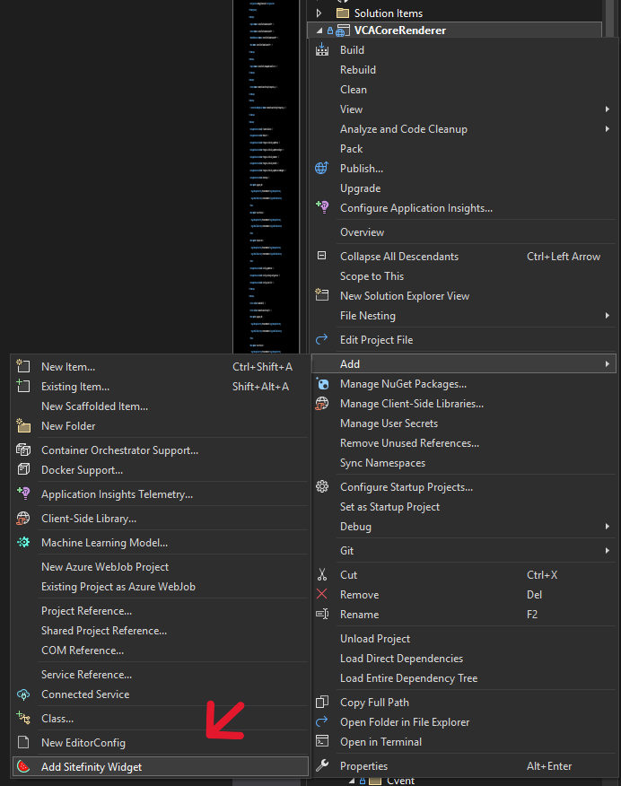

# Sitefinity .NET Core Widget Creator

This Visual Studio extension automates the process of creating **Sitefinity widgets** in .NET Core, allowing developers to quickly generate widget components, including entities, view components, view models, and Razor views.

## Installation
1. Download and install the extension from **Manage Extensions** in Visual Studio.  
2. Restart Visual Studio after installation.  
3. Right-click inside your **project folder** and select **"Add Sitefinity Widget"** from the context menu.  

4. Enter a widget name, and the extension will generate the necessary files.  

## Dependencies
- **.NET Core 3.0 or later**
- **Visual Studio 2019 or later**  
- **Sitefinity .NET Core Renderer** installed in the project  

## How It Works
1. When triggered, the extension prompts you for a **widget name**.  
2. It then generates:  
   - An **Entity** (`{WidgetName}Entity.cs`)  
   - A **View Component** (`{WidgetName}ViewComponent.cs`)  
   - A **View Model** (`{WidgetName}ViewModel.cs`)  
   - A **Razor View** (`Views/Shared/Components/{WidgetName}/Default.cshtml`)  
3. The widget is ready to be customized and used in Sitefinity!  

## Support & Contribution
For issues or feature requests, please create a ticket in the extension repository.

